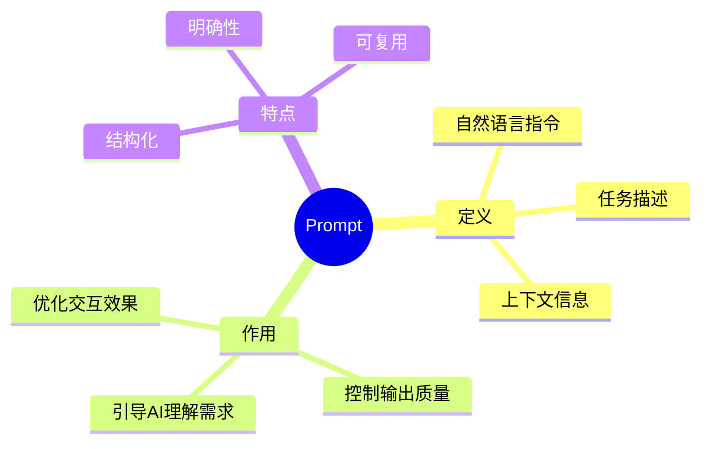
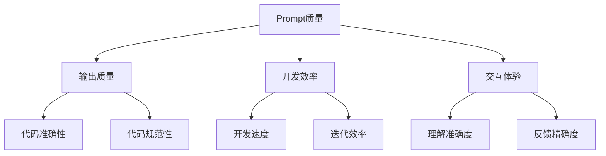
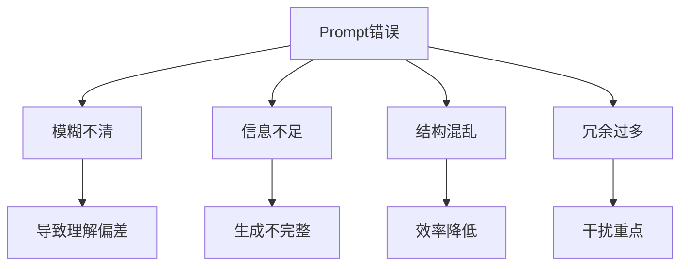
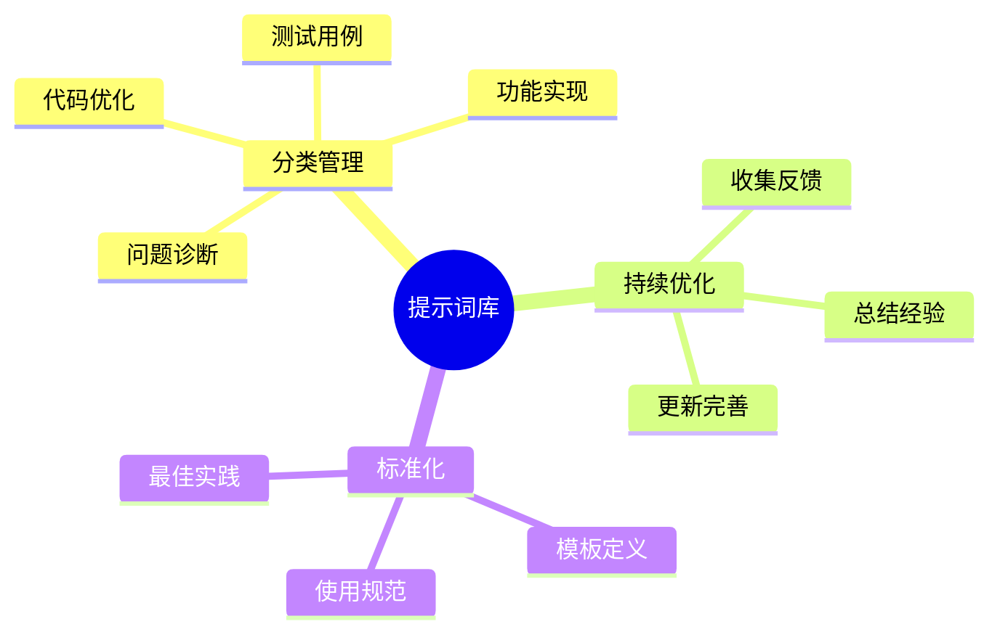

# 第三章 Prompt 创建技巧

## 3.1 Prompt 基础概念

### 3.1.1 什么是 Prompt



### 3.1.2 Prompt 的重要性



## 3.2 Prompt 设计原则

### 3.2.1 核心原则

1. 明确性
```plaintext
- 清晰的目标描述
- 具体的要求说明
- 明确的约束条件
- 预期输出格式
```

2. 完整性
```plaintext
- 必要的上下文信息
- 相关的业务规则
- 技术要求和限制
- 错误处理预期
```

3. 结构化
```plaintext
- 逻辑层次分明
- 信息组织有序
- 重点突出
- 易于理解和修改
```

### 3.2.2 常见错误



## 3.3 Prompt 模式

### 3.3.1 基础模式

1. 任务描述模式
```plaintext
[任务类型]：具体要完成的任务
[输入说明]：输入数据的格式和要求
[输出要求]：期望的输出格式和标准
[约束条件]：需要遵守的规则和限制
```

2. 角色扮演模式
```plaintext
[场景描述]：开发环境和背景
[角色定位]：AI需要扮演的角色
[任务目标]：需要完成的具体工作
[交互方式]：期望的协作模式
```

### 3.3.2 高级模式

1. 迭代优化模式
```plaintext
[初始需求]：基本功能描述
[优化方向]：需要改进的方面
[性能要求]：性能指标和目标
[质量标准]：代码质量要求
```

2. 问题诊断模式
```plaintext
[问题描述]：当前遇到的问题
[环境信息]：开发环境详情
[错误信息]：具体的错误提示
[期望结果]：预期的解决方案
```

## 3.4 场景化 Prompt 示例

### 3.4.1 代码生成场景

1. 功能实现
```plaintext
任务：实现用户认证功能
要求：
- 使用 JWT 进行身份验证
- 包含登录和注册接口
- 实现密码加密存储
- 添加接口文档注释

技术栈：
- Node.js + Express
- MongoDB
- bcrypt 加密

输出要求：
- 完整的代码实现
- API 接口说明
- 错误处理逻辑
```

2. 性能优化
```plaintext
场景：优化数据库查询性能
现状：
- 查询响应时间超过 500ms
- 数据量约 100万条
- 未建立索引

目标：
- 响应时间降至 100ms 以内
- 优化查询语句
- 添加适当索引

约束：
- 不改变现有API
- 最小化内存占用
```

### 3.4.2 代码重构场景

```plaintext
任务：重构遗留代码
代码现状：
- 回调地狱问题
- 重复代码多
- 缺乏错误处理
- 命名不规范

目标：
- 使用 async/await
- 提取公共函数
- 添加异常处理
- 规范化命名

质量要求：
- 遵循 SOLID 原则
- 添加单元测试
- 保持向后兼容
- 完善文档注释
```

## 3.5 Prompt 优化技巧

### 3.5.1 迭代优化


### 3.5.2 上下文管理

1. 信息组织
```plaintext
- 相关性原则
- 重要性排序
- 逻辑分层
- 简洁表达
```

2. 状态维护
```plaintext
- 保持对话连贯
- 及时更新信息
- 清理无关内容
- 控制上下文大小
```

## 3.6 实践建议

### 3.6.1 提示词库建设



### 3.6.2 效果评估

1. 评估维度
```plaintext
- 代码质量
- 响应准确度
- 完成时间
- 可维护性
```

2. 优化方向
```plaintext
- 提示词精确度
- 上下文完整性
- 交互效率
- 输出规范性
```

## 3.7 小结

本章详细介绍了 Prompt 创建的关键技巧：

1. 基础概念
   - Prompt 的定义和重要性
   - 核心设计原则

2. 实用模式
   - 基础模式和高级模式
   - 场景化示例

3. 优化技巧
   - 迭代优化方法
   - 上下文管理策略

4. 实践建议
   - 提示词库建设
   - 效果评估方法

通过本章的学习，您应该能够：
- 理解 Prompt 的核心概念
- 掌握 Prompt 设计原则
- 运用各种 Prompt 模式
- 优化和评估 Prompt 效果

在下一章中，我们将探讨基本操作与实践，将这些 Prompt 技巧应用到实际开发中。
