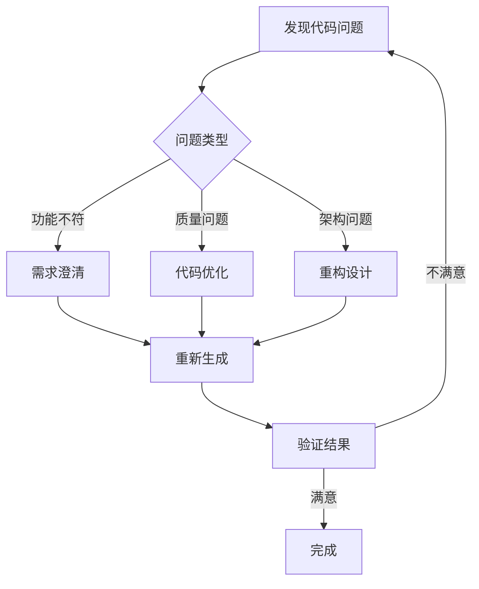
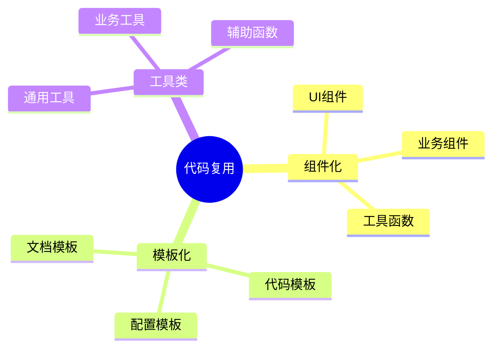
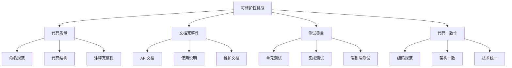
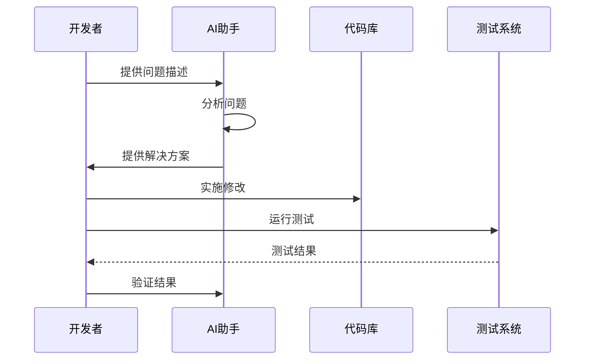

# 第九章 常见问题与解决方案

## 9.1 生成的代码不符合需求怎么办？

### 9.1.1 问题分析流程



### 9.1.2 优化 Prompt 的策略

1. **明确需求**
```markdown
❌ 错误示例：
"生成一个用户管理系统"

✅ 正确示例：
"生成一个用户管理系统，需要包含：
- 用户注册和登录功能
- JWT认证
- 密码加密存储
- 邮箱验证
使用 FastAPI 框架，PostgreSQL 数据库"
```

2. **分步骤引导**
```markdown
第一步：生成数据模型
第二步：实现认证逻辑
第三步：添加业务逻辑
第四步：实现API接口
第五步：添加错误处理
```

### 9.1.3 代码修正示例

```python
# ❌ 原始生成的代码
def create_user(username: str, password: str):
    user = User(username=username, password=password)
    db.add(user)
    db.commit()
    return user

# ✅ 优化后的代码
from passlib.hash import bcrypt
from typing import Optional
from datetime import datetime

async def create_user(
    username: str,
    password: str,
    email: str,
    full_name: Optional[str] = None
) -> User:
    # 参数验证
    if await get_user_by_username(username):
        raise UserExistsError("Username already exists")
    
    # 密码加密
    hashed_password = bcrypt.hash(password)
    
    # 创建用户
    user = User(
        username=username,
        hashed_password=hashed_password,
        email=email,
        full_name=full_name,
        created_at=datetime.utcnow()
    )
    
    try:
        db.add(user)
        await db.commit()
        await db.refresh(user)
        
        # 发送验证邮件
        await send_verification_email(user.email)
        return user
    except Exception as e:
        await db.rollback()
        raise DatabaseError(f"Failed to create user: {str(e)}")
```

## 9.2 如何有效避免重复生成代码？

### 9.2.1 代码复用策略



### 9.2.2 模块化示例

```typescript
// 通用的 HTTP 请求处理
// api/http.ts
import axios, { AxiosResponse, AxiosError } from 'axios';

export class HttpClient {
    private static instance: HttpClient;
    private baseURL: string;

    private constructor() {
        this.baseURL = process.env.API_BASE_URL || '';
        this.setupInterceptors();
    }

    public static getInstance(): HttpClient {
        if (!HttpClient.instance) {
            HttpClient.instance = new HttpClient();
        }
        return HttpClient.instance;
    }

    private setupInterceptors(): void {
        axios.interceptors.response.use(
            this.handleSuccess,
            this.handleError
        );
    }

    private handleSuccess(response: AxiosResponse): AxiosResponse {
        return response;
    }

    private handleError(error: AxiosError): Promise<never> {
        if (error.response?.status === 401) {
            // 处理认证错误
            this.handleAuthError();
        }
        return Promise.reject(error);
    }

    private handleAuthError(): void {
        // 处理认证错误的逻辑
    }

    public async get<T>(url: string, params?: object): Promise<T> {
        const response = await axios.get(`${this.baseURL}${url}`, { params });
        return response.data;
    }

    public async post<T>(url: string, data?: object): Promise<T> {
        const response = await axios.post(`${this.baseURL}${url}`, data);
        return response.data;
    }
}

// 使用示例
// services/userService.ts
import { HttpClient } from '../api/http';

export class UserService {
    private http = HttpClient.getInstance();

    async getUsers() {
        return this.http.get('/users');
    }

    async createUser(userData: UserData) {
        return this.http.post('/users', userData);
    }
}
```

### 9.2.3 代码生成模板

```python
# 通用的 CRUD 操作基类
from typing import Generic, TypeVar, Type, Optional
from pydantic import BaseModel
from sqlalchemy.orm import Session
from fastapi import HTTPException

ModelType = TypeVar("ModelType")
CreateSchemaType = TypeVar("CreateSchemaType", bound=BaseModel)
UpdateSchemaType = TypeVar("UpdateSchemaType", bound=BaseModel)

class CRUDBase(Generic[ModelType, CreateSchemaType, UpdateSchemaType]):
    def __init__(self, model: Type[ModelType]):
        self.model = model

    async def get(
        self,
        db: Session,
        id: int
    ) -> Optional[ModelType]:
        return await db.query(self.model).filter(self.model.id == id).first()

    async def get_multi(
        self,
        db: Session,
        *,
        skip: int = 0,
        limit: int = 100
    ):
        return await db.query(self.model).offset(skip).limit(limit).all()

    async def create(
        self,
        db: Session,
        *,
        obj_in: CreateSchemaType
    ) -> ModelType:
        obj_in_data = obj_in.dict()
        db_obj = self.model(**obj_in_data)
        db.add(db_obj)
        await db.commit()
        await db.refresh(db_obj)
        return db_obj

    async def update(
        self,
        db: Session,
        *,
        db_obj: ModelType,
        obj_in: UpdateSchemaType
    ) -> ModelType:
        obj_data = obj_in.dict(exclude_unset=True)
        for field in obj_data:
            setattr(db_obj, field, obj_data[field])
        db.add(db_obj)
        await db.commit()
        await db.refresh(db_obj)
        return db_obj

    async def remove(
        self,
        db: Session,
        *,
        id: int
    ) -> ModelType:
        obj = await db.query(self.model).get(id)
        await db.delete(obj)
        await db.commit()
        return obj
```

## 9.3 AI 生成代码的可维护性问题

### 9.3.1 可维护性挑战



### 9.3.2 最佳实践

1. **代码规范化**
```python
# ❌ 不规范的代码
def do_stuff(x,y):
    z=x+y
    return z

# ✅ 规范的代码
from typing import Union, Number
from logging import getLogger

logger = getLogger(__name__)

def calculate_sum(
    first_number: Union[int, float],
    second_number: Union[int, float]
) -> Number:
    """计算两个数字的和
    
    Args:
        first_number: 第一个数字
        second_number: 第二个数字
        
    Returns:
        两个数字的和
        
    Raises:
        TypeError: 当输入参数类型不正确时
    """
    try:
        result = first_number + second_number
        logger.debug(f"Calculated sum: {result}")
        return result
    except TypeError as e:
        logger.error(f"Failed to calculate sum: {str(e)}")
        raise
```

2. **测试驱动开发**
```python
# tests/test_calculator.py
import pytest
from app.calculator import calculate_sum

def test_calculate_sum_with_integers():
    assert calculate_sum(1, 2) == 3

def test_calculate_sum_with_floats():
    assert abs(calculate_sum(1.1, 2.2) - 3.3) < 0.0001

def test_calculate_sum_with_invalid_types():
    with pytest.raises(TypeError):
        calculate_sum("1", 2)
```

### 9.3.3 维护清单

✅ 代码风格检查
✅ 自动化测试
✅ 文档更新
✅ 依赖管理
✅ 版本控制
✅ 持续集成
✅ 代码评审
✅ 性能监控

## 9.4 问题预防与解决方案

### 9.4.1 常见问题分类

| 问题类型 | 典型症状 | 解决方案 | 预防措施 |
|---------|---------|---------|---------|
| 代码质量 | 难以理解和维护 | 重构和优化 | 制定编码规范 |
| 性能问题 | 响应慢、资源占用高 | 性能优化 | 性能测试 |
| 安全漏洞 | 数据泄露、未授权访问 | 安全加固 | 安全审计 |
| 可扩展性 | 难以添加新功能 | 架构重构 | 模块化设计 |

### 9.4.2 问题解决流程



## 9.5 总结与建议

### 9.5.1 关键要点

1. **提高代码质量**
   - 清晰的命名
   - 完整的注释
   - 合理的结构

2. **加强测试覆盖**
   - 单元测试
   - 集成测试
   - 性能测试

3. **完善文档体系**
   - API文档
   - 使用说明
   - 维护文档

### 9.5.2 持续改进

1. **定期代码审查**
   - 代码质量
   - 安全问题
   - 性能优化

2. **技术栈更新**
   - 新特性应用
   - 依赖更新
   - 架构优化

3. **团队协作**
   - 知识共享
   - 经验总结
   - 最佳实践

通过本章的学习，读者应该能够更好地处理 AI 辅助开发中遇到的各种问题，并能够采取适当的措施来提高代码质量和可维护性。记住，AI 是一个强大的工具，但最终的代码质量和可维护性仍然需要开发者的专业判断和持续努力。

---
[回到目录](Readme.md)

上一章：[第八章-完整项目开发：用户管理系统](第八章-完整项目开发：用户管理系统.md)

下一章：[第十章-AI辅助开发的未来](第十章-AI辅助开发的未来.md)
