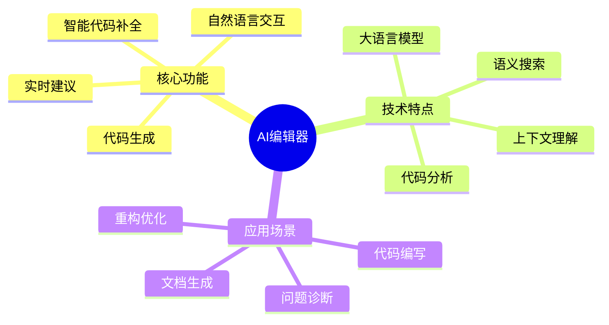
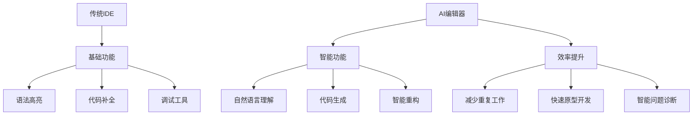
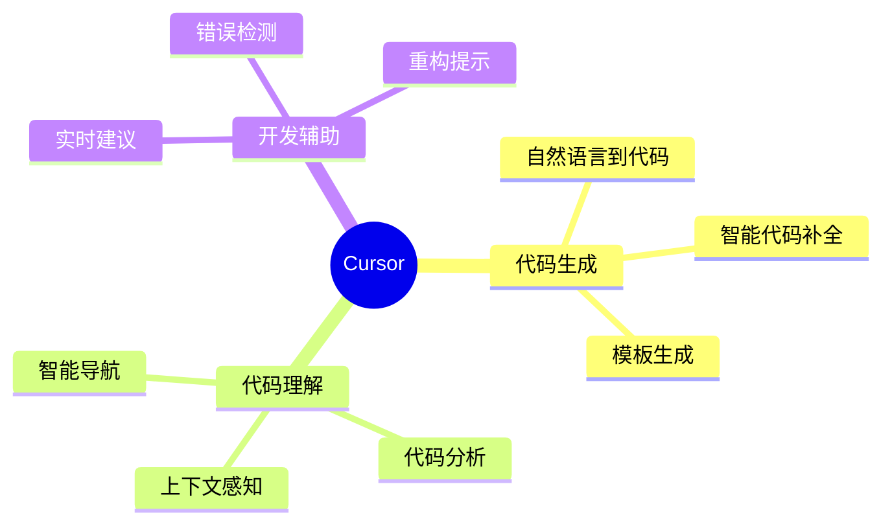
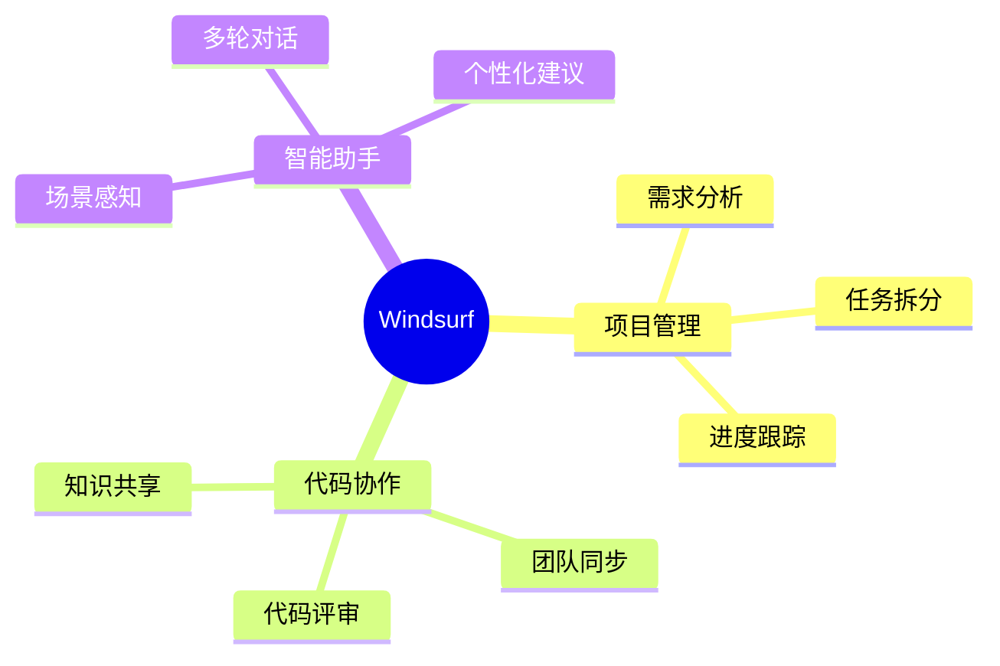
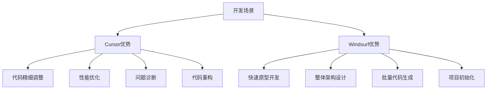
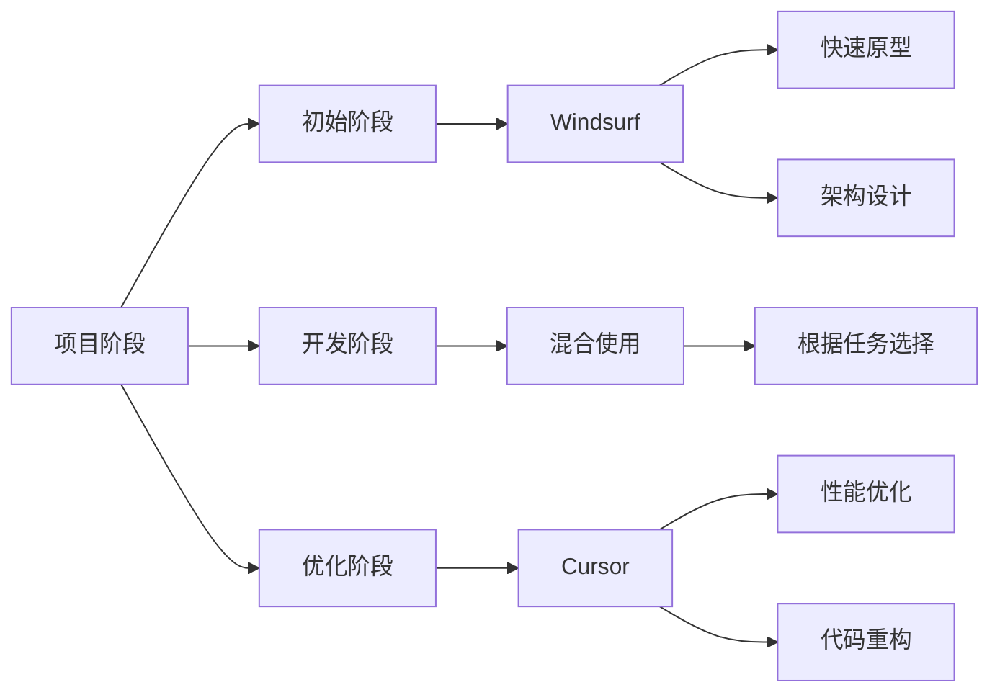
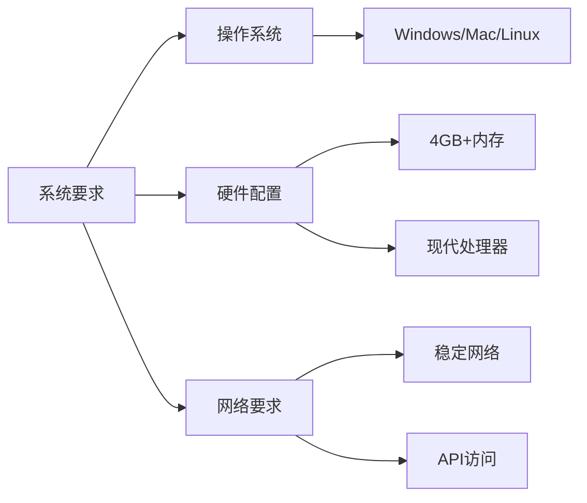
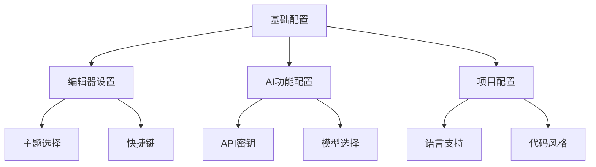
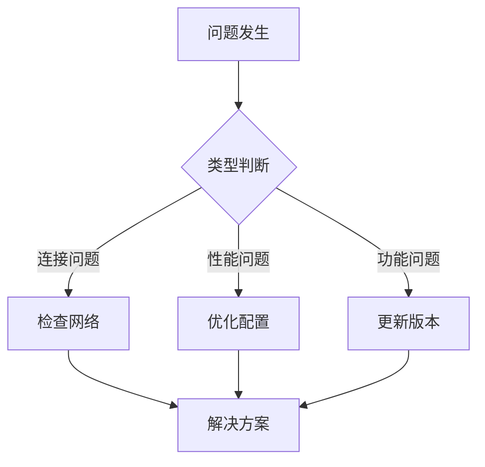

# 第二章 AI 编辑器简介

## 2.1 AI 编辑器概述

### 2.1.1 什么是 AI 编辑器



### 2.1.2 AI 编辑器的优势



## 2.2 Cursor 与 Windsurf 的特点

### 2.2.1 Cursor 的主要特性



### 2.2.2 Windsurf 的主要特性



## 2.3 不同场景下的工具选择

### 2.3.1 场景分析



### 2.3.2 选择建议

1. Cursor 优势场景
```plaintext
- 代码精细化调整和优化
- 特定功能的性能优化
- 复杂问题的诊断和修复
- 局部代码的重构和改进
- 具体算法的实现和优化
- 代码质量提升
- 单元测试编写
```

2. Windsurf 优势场景
```plaintext
- 快速原型开发和验证
- 项目整体架构设计
- 大规模代码生成
- 项目框架搭建
- 完整功能模块生成
- API 接口设计和实现
- 数据模型设计
```

### 2.3.3 实际应用策略



### 2.3.4 使用建议

1. 项目初期
```plaintext
优先选择 Windsurf：
- 快速搭建项目框架
- 生成基础代码结构
- 设计整体架构
- 实现核心功能原型
```

2. 开发过程中
```plaintext
根据具体任务选择：
- 新功能模块开发：Windsurf
- 代码优化和调整：Cursor
- 问题修复：Cursor
- 功能扩展：视复杂度选择
```

3. 优化阶段
```plaintext
优先选择 Cursor：
- 性能调优
- 代码重构
- 问题诊断
- 测试用例补充
```

## 2.4 安装与配置

### 2.4.1 环境要求



### 2.4.2 安装步骤

1. Cursor 安装
```plaintext
1. 访问官网下载安装包
2. 运行安装程序
3. 配置开发环境
4. 设置 AI 功能
```

2. Windsurf 安装
```plaintext
1. 获取安装权限
2. 下载安装包
3. 完成安装
4. 团队配置
```

### 2.4.3 基础配置



## 2.5 使用技巧

### 2.5.1 通用技巧

1. 环境准备
```plaintext
- 确保网络稳定
- 配置代理（如需）
- 更新到最新版本
```

2. 性能优化
```plaintext
- 合理设置缓存
- 管理项目大小
- 优化响应时间
```

### 2.5.2 常见问题解决



## 2.6 小结

本章详细介绍了 AI 编辑器的基本概念和特点：

1. AI 编辑器概述
   - 核心功能和技术特点
   - 相比传统 IDE 的优势

2. 工具特点比较
   - Cursor 的主要特性
   - Windsurf 的主要特性

3. 场景选择指南
   - 不同场景的工具选择
   - 具体应用建议

4. 安装配置指南
   - 环境要求
   - 安装步骤
   - 基础配置

通过本章的学习，您应该能够：
- 理解 AI 编辑器的基本概念
- 了解不同工具的特点
- 根据场景选择合适的工具
- 完成工具的安装和配置

在下一章中，我们将深入探讨如何创建有效的 Prompt，这是充分利用 AI 编辑器的关键技能。

---
[回到目录](Readme.md)

上一章：[第一章-基础入门](第一章-基础入门.md)

下一章：[第三章-Prompt创建技巧](第三章-Prompt创建技巧.md)
