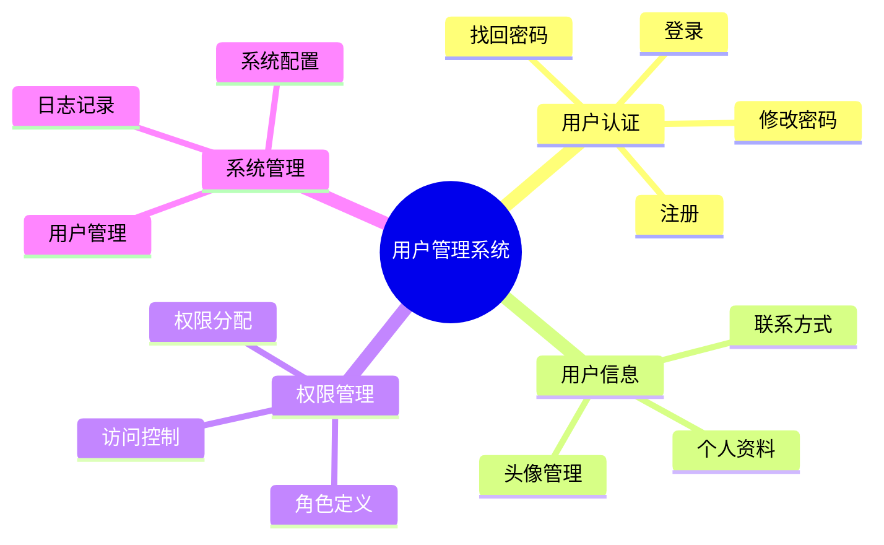
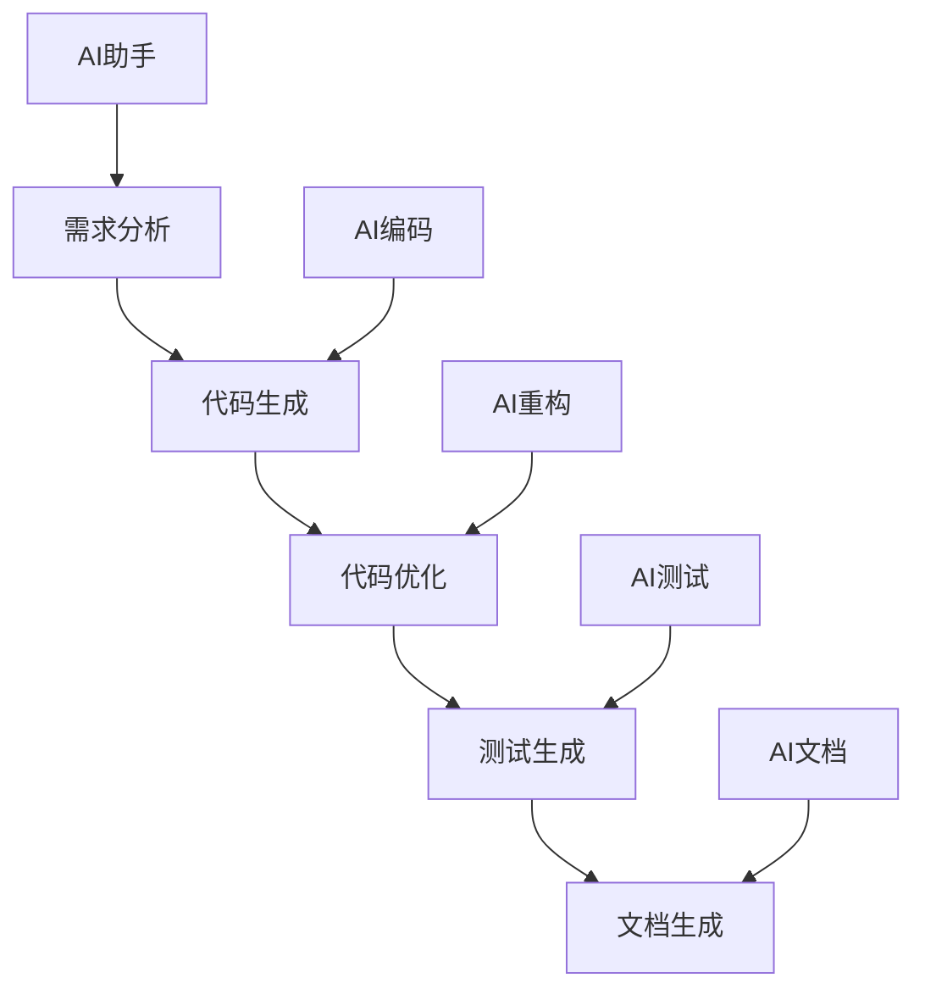
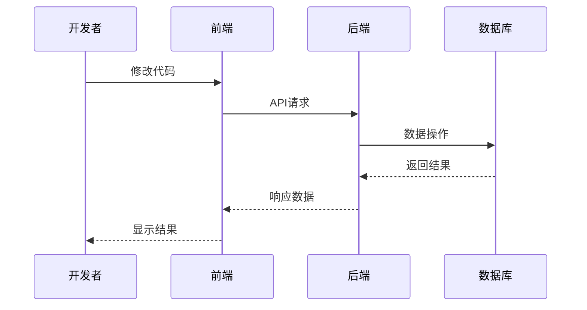
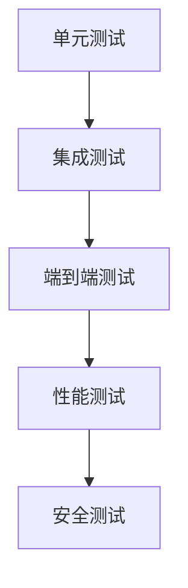
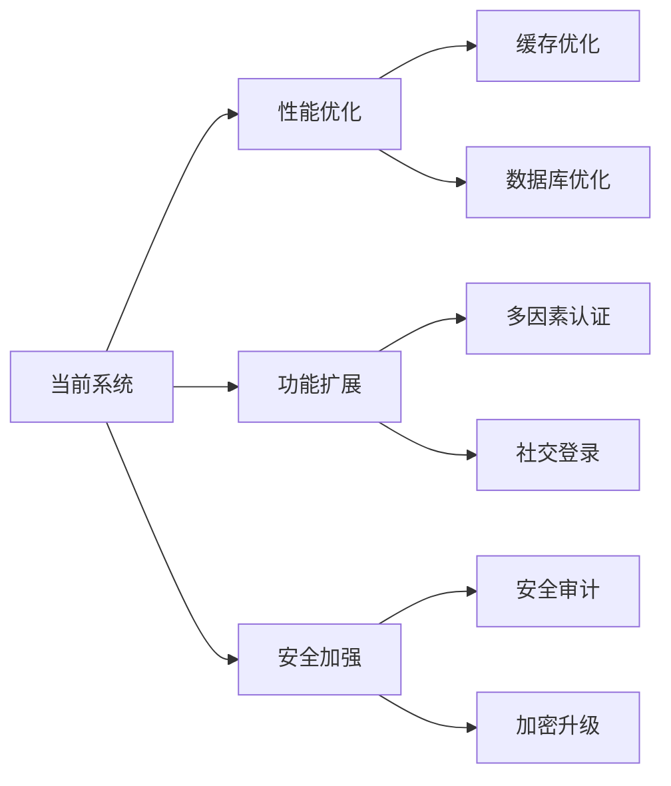

# 第八章 完整项目开发：用户管理系统

## 8.1 项目需求分析与拆分

### 8.1.1 项目概述

用户管理系统是一个基于 Web 的应用程序，提供用户注册、认证、权限管理等功能。本章将通过这个实际项目，展示如何使用 AI 辅助工具进行完整的开发流程。

### 8.1.2 功能需求



### 8.1.3 技术栈选择

- 前端：React + TypeScript
- 后端：Python FastAPI
- 数据库：PostgreSQL
- 缓存：Redis
- 部署：Docker + Kubernetes

## 8.2 选择合适的 AI 工具

### 8.2.1 开发流程中的 AI 工具应用



### 8.2.2 工具使用策略

| 开发阶段 | AI 工具应用 | 预期效果 |
|---------|------------|---------|
| 需求分析 | 需求拆分建议 | 合理的功能模块划分 |
| 代码生成 | 基础代码框架 | 快速搭建项目结构 |
| 代码优化 | 代码质量建议 | 提高代码质量和性能 |
| 测试生成 | 测试用例生成 | 提高测试覆盖率 |
| 文档生成 | API文档生成 | 完整的项目文档 |

## 8.3 代码生成与优化

### 8.3.1 项目结构

```
user-management-system/
├── frontend/
│   ├── src/
│   │   ├── components/
│   │   ├── pages/
│   │   ├── services/
│   │   └── utils/
├── backend/
│   ├── app/
│   │   ├── api/
│   │   ├── core/
│   │   ├── models/
│   │   └── services/
├── tests/
└── docs/
```

### 8.3.2 后端核心代码示例

```python
# backend/app/models/user.py
from sqlalchemy import Column, Integer, String, DateTime
from app.core.database import Base

class User(Base):
    __tablename__ = "users"

    id = Column(Integer, primary_key=True, index=True)
    username = Column(String, unique=True, index=True)
    email = Column(String, unique=True, index=True)
    hashed_password = Column(String)
    created_at = Column(DateTime)
    updated_at = Column(DateTime)

# backend/app/api/endpoints/users.py
from fastapi import APIRouter, Depends, HTTPException
from app.core.auth import get_current_user
from app.services.user_service import UserService

router = APIRouter()

@router.post("/users/")
async def create_user(user_data: UserCreate):
    return await UserService.create_user(user_data)

@router.get("/users/me")
async def get_current_user_info(current_user: User = Depends(get_current_user)):
    return current_user

@router.put("/users/{user_id}")
async def update_user(
    user_id: int,
    user_data: UserUpdate,
    current_user: User = Depends(get_current_user)
):
    if current_user.id != user_id:
        raise HTTPException(status_code=403, detail="Not authorized")
    return await UserService.update_user(user_id, user_data)
```

### 8.3.3 前端实现示例

```typescript
// frontend/src/services/api.ts
import axios from 'axios';

const api = axios.create({
  baseURL: process.env.REACT_APP_API_URL,
});

api.interceptors.request.use((config) => {
  const token = localStorage.getItem('token');
  if (token) {
    config.headers.Authorization = `Bearer ${token}`;
  }
  return config;
});

export const userApi = {
  login: (credentials: LoginCredentials) => 
    api.post('/auth/login', credentials),
  register: (userData: RegisterData) => 
    api.post('/users', userData),
  getCurrentUser: () => 
    api.get('/users/me'),
  updateProfile: (userId: number, data: UpdateProfileData) =>
    api.put(`/users/${userId}`, data),
};

// frontend/src/components/UserProfile.tsx
import React, { useState, useEffect } from 'react';
import { useAuth } from '../hooks/useAuth';
import { userApi } from '../services/api';

export const UserProfile: React.FC = () => {
  const { user } = useAuth();
  const [profile, setProfile] = useState(null);

  useEffect(() => {
    const fetchProfile = async () => {
      try {
        const response = await userApi.getCurrentUser();
        setProfile(response.data);
      } catch (error) {
        console.error('Failed to fetch profile:', error);
      }
    };

    fetchProfile();
  }, []);

  return (
    <div className="profile-container">
      {profile && (
        <>
          <h1>个人资料</h1>
          <div className="profile-info">
            <p>用户名: {profile.username}</p>
            <p>邮箱: {profile.email}</p>
            <p>注册时间: {new Date(profile.created_at).toLocaleDateString()}</p>
          </div>
        </>
      )}
    </div>
  );
};
```

## 8.4 调试与集成

### 8.4.1 调试流程



### 8.4.2 常见问题及解决方案

1. **认证问题**
```typescript
// 问题：Token 过期处理
api.interceptors.response.use(
  (response) => response,
  async (error) => {
    if (error.response.status === 401) {
      // Token 过期，刷新 Token
      try {
        const newToken = await refreshToken();
        // 重试失败的请求
        error.config.headers.Authorization = `Bearer ${newToken}`;
        return api.request(error.config);
      } catch (e) {
        // 刷新失败，退出登录
        logout();
        return Promise.reject(error);
      }
    }
    return Promise.reject(error);
  }
);
```

2. **性能优化**
```python
# 使用缓存优化查询性能
from functools import lru_cache
from app.core.cache import redis_cache

class UserService:
    @lru_cache(maxsize=1000)
    async def get_user_by_id(self, user_id: int) -> User:
        return await self.db.query(User).filter(User.id == user_id).first()

    @redis_cache(expire=3600)
    async def get_user_permissions(self, user_id: int) -> List[Permission]:
        return await self.db.query(Permission).filter(
            Permission.user_id == user_id
        ).all()
```

## 8.5 测试与部署

### 8.5.1 测试策略



### 8.5.2 测试用例示例

```python
# tests/test_user_service.py
import pytest
from app.services.user_service import UserService
from app.models.user import User

@pytest.fixture
def user_service():
    return UserService()

@pytest.mark.asyncio
async def test_create_user(user_service):
    user_data = {
        "username": "testuser",
        "email": "test@example.com",
        "password": "password123"
    }
    user = await user_service.create_user(user_data)
    assert user.username == user_data["username"]
    assert user.email == user_data["email"]

@pytest.mark.asyncio
async def test_get_user_by_id(user_service):
    # 创建测试用户
    user_data = {
        "username": "testuser2",
        "email": "test2@example.com",
        "password": "password123"
    }
    created_user = await user_service.create_user(user_data)
    
    # 测试获取用户
    user = await user_service.get_user_by_id(created_user.id)
    assert user is not None
    assert user.id == created_user.id
```

### 8.5.3 部署配置

```yaml
# docker-compose.yml
version: '3.8'

services:
  frontend:
    build: ./frontend
    ports:
      - "3000:3000"
    environment:
      - REACT_APP_API_URL=http://backend:8000

  backend:
    build: ./backend
    ports:
      - "8000:8000"
    environment:
      - DATABASE_URL=postgresql://user:password@db:5432/user_management
      - REDIS_URL=redis://redis:6379
    depends_on:
      - db
      - redis

  db:
    image: postgres:13
    environment:
      - POSTGRES_USER=user
      - POSTGRES_PASSWORD=password
      - POSTGRES_DB=user_management
    volumes:
      - postgres_data:/var/lib/postgresql/data

  redis:
    image: redis:6
    ports:
      - "6379:6379"

volumes:
  postgres_data:
```

## 8.6 项目总结

### 8.6.1 开发流程回顾

1. **需求分析**
   - 功能模块划分
   - 技术栈选择
   - 开发计划制定

2. **开发实施**
   - 基础架构搭建
   - 功能模块实现
   - 代码优化重构

3. **测试与部署**
   - 单元测试编写
   - 集成测试执行
   - 容器化部署

### 8.6.2 经验总结

1. **AI 工具的价值**
   - 加速开发进度
   - 提高代码质量
   - 减少重复工作

2. **最佳实践**
   - 模块化设计
   - 代码复用
   - 持续集成
   - 自动化测试

3. **注意事项**
   - 安全性考虑
   - 性能优化
   - 可维护性
   - 文档完整性

### 8.6.3 项目改进建议



## 8.7 总结

本章通过一个完整的用户管理系统项目，展示了如何在实际开发中运用 AI 辅助工具。从需求分析到最终部署，每个环节都展示了 AI 工具的实际应用价值。通过这个案例，读者可以更好地理解如何在自己的项目中使用 AI 工具提高开发效率和代码质量。

---
[回到目录](Readme.md)

上一章：[第七章-团队协作与代码标准化](第七章-团队协作与代码标准化.md)

下一章：[第九章-常见问题与解决方案](第九章-常见问题与解决方案.md)
