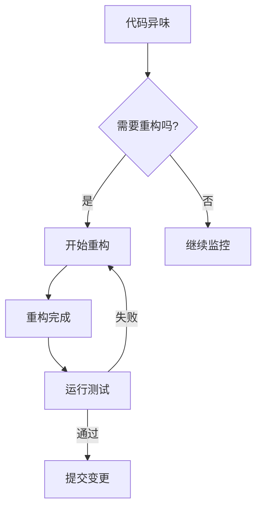
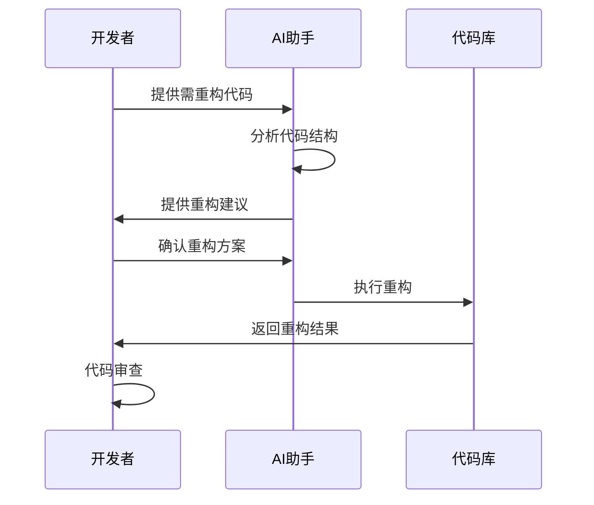
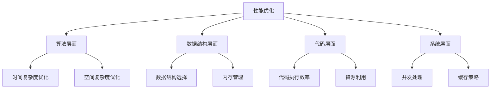

# 第六章 代码重构与优化

## 6.1 代码重构的必要性

在软件开发过程中，代码重构是一项至关重要的工作。它不仅能提高代码质量，还能改善系统的可维护性和可扩展性。本节将探讨为什么需要代码重构，以及如何识别需要重构的代码。

### 6.1.1 什么是代码重构？

代码重构是在不改变代码外部行为的前提下，对代码进行重新构造的过程。这个过程主要目的是：
- 提高代码的可读性
- 降低代码的复杂度
- 改善代码的结构
- 消除技术债务

### 6.1.2 重构的时机



常见的需要重构的场景：
1. 代码重复度高
2. 方法过长
3. 类职责不清
4. 过度耦合
5. 难以测试的代码

## 6.2 使用 AI 工具优化代码质量

AI 工具在代码重构中可以发挥重要作用，它们能够：

### 6.2.1 AI 辅助重构的流程



### 6.2.2 AI 工具的最佳实践

1. **代码分析**
   - 使用 AI 进行代码质量分析
   - 识别潜在的问题区域
   - 获取重构建议

2. **重构策略**
   - 提取方法
   - 重命名变量
   - 简化条件表达式
   - 移动方法或字段

3. **代码优化**
   - 自动化重构
   - 模式识别
   - 代码标准化

## 6.3 性能优化技巧

### 6.3.1 性能优化的层次



### 6.3.2 常见性能优化方法

1. **算法优化**
   - 选择适当的算法
   - 减少时间复杂度
   - 优化空间使用

2. **数据库优化**
   - 索引优化
   - SQL语句优化
   - 数据库结构优化

3. **缓存策略**
   - 内存缓存
   - 分布式缓存
   - 多级缓存架构

## 6.4 重构示例：提升代码性能

### 6.4.1 案例分析：用户查询优化

以下是一个实际的代码重构示例，展示如何优化一个用户查询系统：

**重构前：**
```python
def search_users(query):
    results = []
    for user in all_users:
        if query.lower() in user.name.lower():
            results.append(user)
    return results
```

**重构后：**
```python
from collections import defaultdict
import redis

class UserSearchService:
    def __init__(self):
        self.cache = redis.Redis()
        self._init_index()

    def _init_index(self):
        self.name_index = defaultdict(list)
        for user in all_users:
            self.name_index[user.name.lower()].append(user)

    def search_users(self, query):
        cache_key = f"search:{query.lower()}"
        
        # 检查缓存
        if cached := self.cache.get(cache_key):
            return cached

        # 使用索引搜索
        results = self.name_index.get(query.lower(), [])
        
        # 存入缓存
        self.cache.setex(cache_key, 3600, results)
        return results
```

### 6.4.2 性能对比

```mermaid
graph LR
    A[重构前] --> B[O(n)]
    A --> C[无缓存]
    A --> D[内存占用大]
    
    E[重构后] --> F[O(1)]
    E --> G[Redis缓存]
    E --> H[内存优化]
```

## 6.5 重构核对清单

✅ 单元测试覆盖
✅ 代码审查
✅ 性能测试
✅ 文档更新
✅ 部署计划

## 6.6 注意事项与最佳实践

1. **循序渐进**
   - 小步重构
   - 持续集成
   - 及时测试

2. **保持沟通**
   - 团队协作
   - 代码评审
   - 文档更新

3. **监控效果**
   - 性能指标
   - 代码质量
   - 用户反馈

## 6.7 总结

代码重构和优化是一个持续的过程，需要结合实际情况和团队特点来进行。通过合理使用 AI 工具，可以大大提高重构效率和代码质量。记住，重构的目的是为了让代码更好维护、更容易理解，而不是为了重构而重构。

---
[回到目录](Readme.md)

上一章：[第五章-分阶段开发指南](第五章-分阶段开发指南.md)

下一章：[第七章-团队协作与代码标准化](第七章-团队协作与代码标准化.md)
