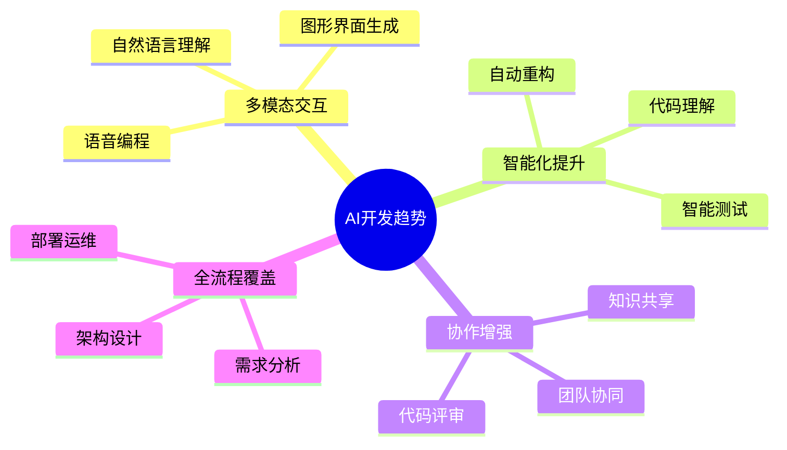
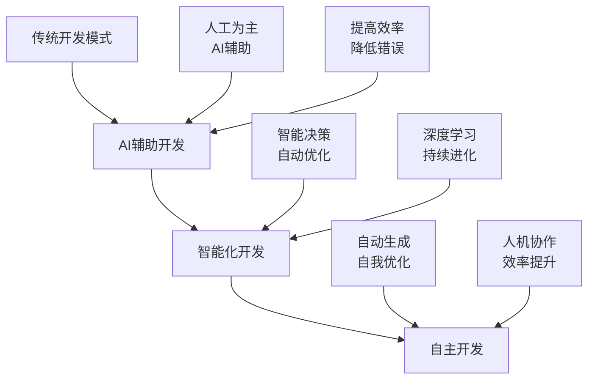
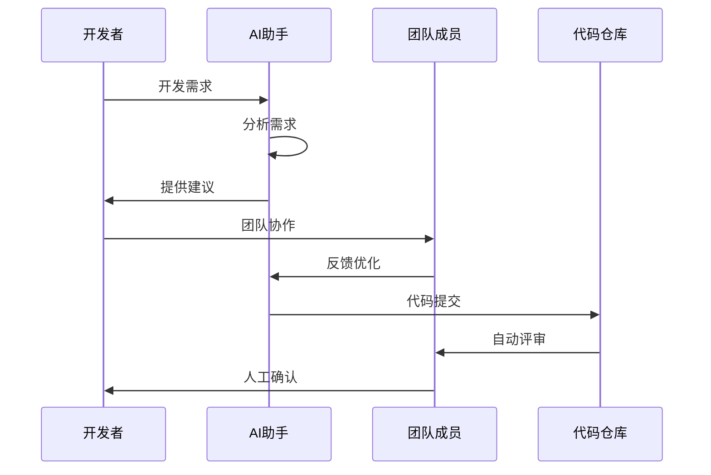
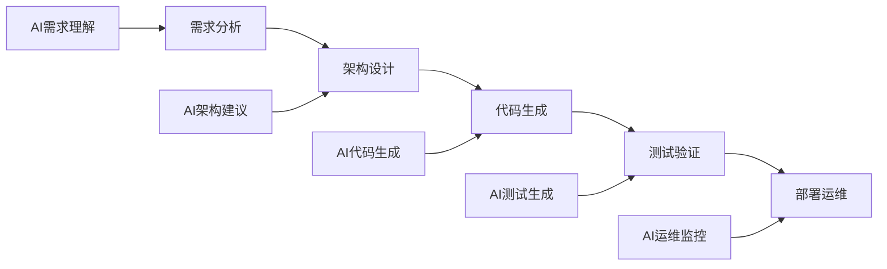
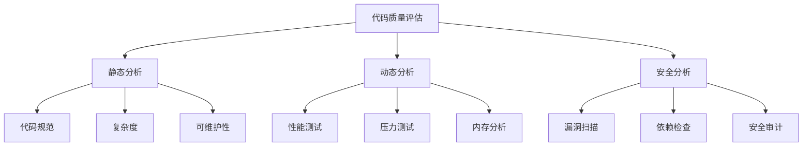
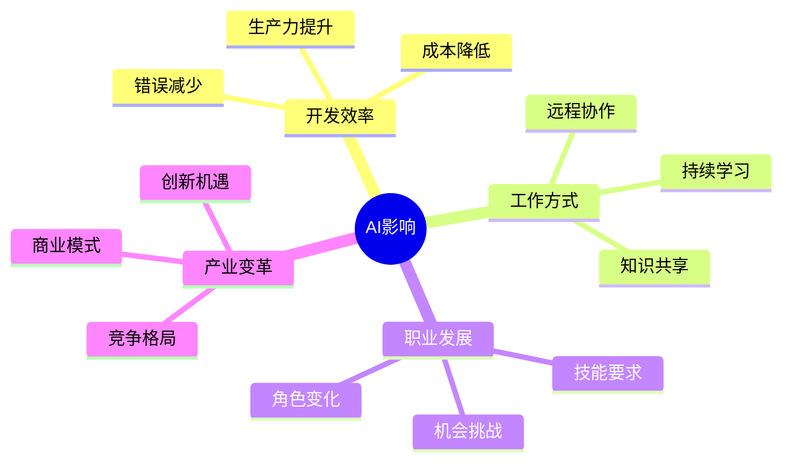
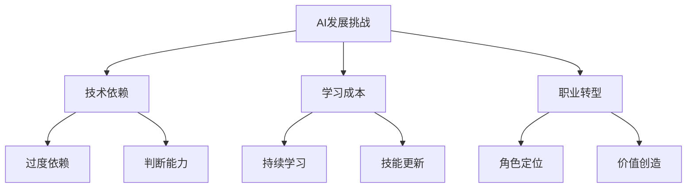

# 第十章 AI 辅助开发的未来

## 10.1 AI 辅助开发的趋势

### 10.1.1 技术发展趋势



### 10.1.2 应用场景扩展



## 10.2 工具功能的演进方向

### 10.2.1 智能化提升

1. **代码理解与重构**
```python
# 未来的AI可能理解更复杂的代码结构
class AICodeAnalyzer:
    def analyze_code_structure(self, code: str) -> Dict[str, Any]:
        """分析代码结构并提供优化建议
        
        特点：
        1. 深度理解代码语义
        2. 识别设计模式
        3. 提供重构建议
        4. 性能优化分析
        """
        pass

    def suggest_improvements(self, analysis: Dict[str, Any]) -> List[Suggestion]:
        """基于分析结果提供改进建议"""
        pass

    def auto_refactor(self, code: str, suggestions: List[Suggestion]) -> str:
        """自动执行代码重构"""
        pass
```

2. **智能测试生成**
```python
class AITestGenerator:
    def generate_test_cases(self, code: str) -> List[TestCase]:
        """自动生成全面的测试用例
        
        特点：
        1. 边界条件覆盖
        2. 异常场景测试
        3. 性能测试用例
        4. 安全测试场景
        """
        pass

    def maintain_test_suite(self, code_changes: List[Change]) -> List[TestUpdate]:
        """智能更新测试套件"""
        pass
```

### 10.2.2 协作增强



### 10.2.3 全流程智能化



## 10.3 如何提升 AI 生成代码的质量

### 10.3.1 提升策略

1. **优化输入质量**
```markdown
# 高质量的需求描述示例

## 功能需求
- 用户认证模块
  - 支持多种登录方式
  - 包含权限管理
  - 日志记录

## 技术要求
- 使用 Spring Boot 框架
- MySQL 数据库
- Redis 缓存
- Docker 部署

## 性能要求
- 响应时间 < 100ms
- 并发用户 > 1000
- 99.9% 可用性
```

2. **代码质量保证**
```python
class CodeQualityChecker:
    def __init__(self):
        self.metrics = {
            'complexity': ComplexityAnalyzer(),
            'maintainability': MaintainabilityAnalyzer(),
            'performance': PerformanceAnalyzer(),
            'security': SecurityAnalyzer()
        }
    
    async def check_code_quality(self, code: str) -> QualityReport:
        """全方位的代码质量检查
        
        检查项目：
        1. 代码复杂度
        2. 可维护性指标
        3. 性能分析
        4. 安全漏洞检测
        """
        results = await asyncio.gather(*[
            analyzer.analyze(code)
            for analyzer in self.metrics.values()
        ])
        
        return self.generate_report(results)
```

### 10.3.2 质量评估体系



## 10.4 未来展望

### 10.4.1 技术革新

1. **深度学习增强**
   - 更好的代码理解
   - 更准确的需求转换
   - 更智能的问题解决

2. **自然语言处理**
   - 更自然的交互方式
   - 更准确的语义理解
   - 多语言支持

3. **自动化程度提升**
   - 端到端解决方案
   - 自动化测试与部署
   - 智能运维

### 10.4.2 行业影响



## 10.5 开发者的机遇与挑战

### 10.5.1 新机遇

1. **技能提升**
   - AI 工具应用能力
   - 系统架构设计
   - 问题解决能力

2. **效率提升**
   - 快速原型开发
   - 自动化测试
   - 智能化运维

3. **创新机会**
   - 新技术应用
   - 新产品开发
   - 新模式探索

### 10.5.2 潜在挑战



## 10.6 准备与建议

### 10.6.1 技能储备

1. **核心能力**
   - 编程基础
   - 架构设计
   - 问题分析
   - 团队协作

2. **工具掌握**
   - AI 开发工具
   - 自动化工具
   - 协作工具

3. **持续学习**
   - 新技术跟踪
   - 实践总结
   - 知识分享

### 10.6.2 发展建议

1. **短期目标**
   - 掌握 AI 工具
   - 提高开发效率
   - 积累项目经验

2. **中期规划**
   - 深化技术能力
   - 扩展技术栈
   - 参与开源项目

3. **长期发展**
   - 技术创新
   - 架构能力
   - 团队领导

## 10.7 总结

AI 辅助开发正在快速发展，未来将在以下方面带来重大变革：

1. **技术层面**
   - 更智能的代码生成
   - 更准确的需求理解
   - 更全面的质量保证

2. **工作方式**
   - 更高效的协作模式
   - 更灵活的开发流程
   - 更智能的辅助工具

3. **职业发展**
   - 新的技能要求
   - 新的职业机会
   - 新的发展方向

开发者需要积极适应这些变化，提升相关能力，把握发展机遇，在 AI 时代创造更大的价值。

---
[回到目录](Readme.md)

上一章：[第九章-常见问题与解决方案](第九章-常见问题与解决方案.md)

下一章：[第十一章-高效开发实践](第十一章-高效开发实践.md)
