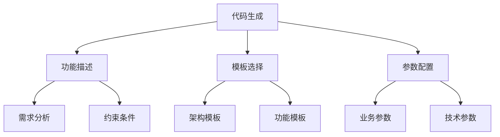
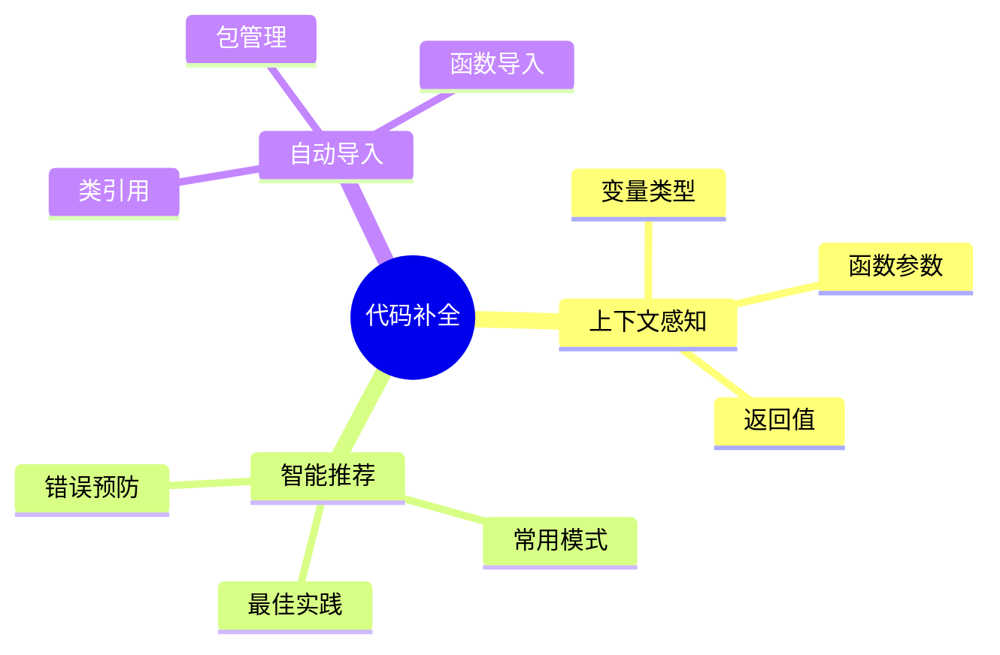
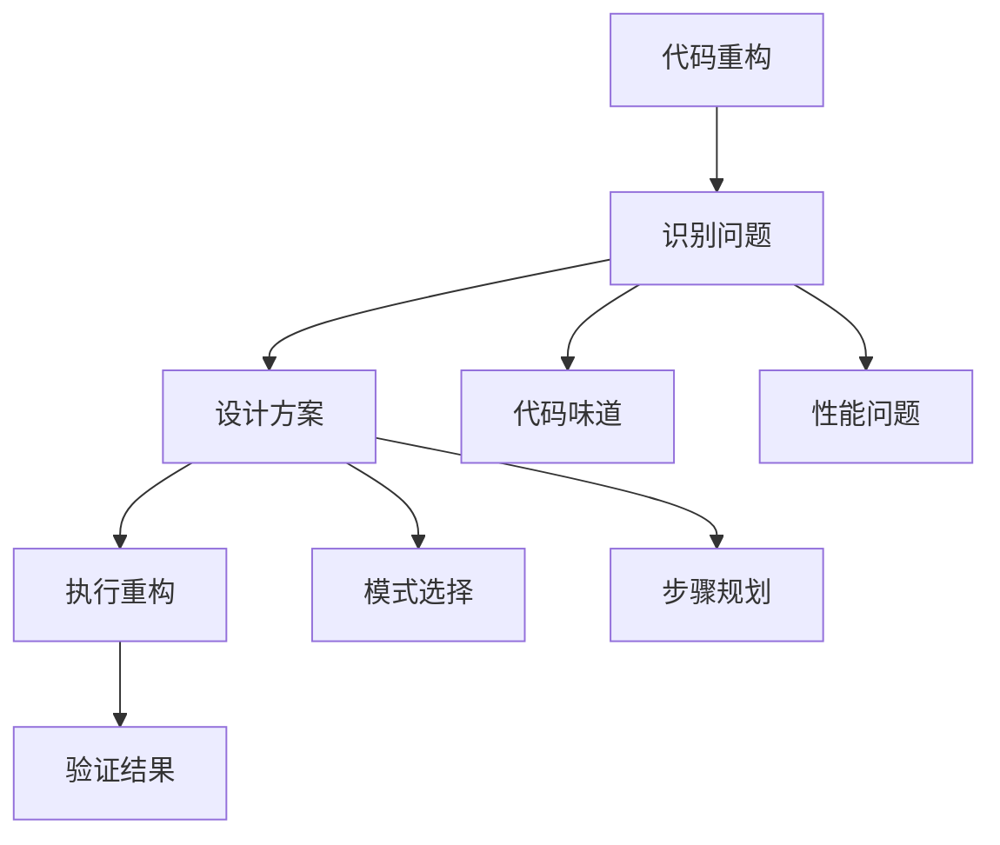
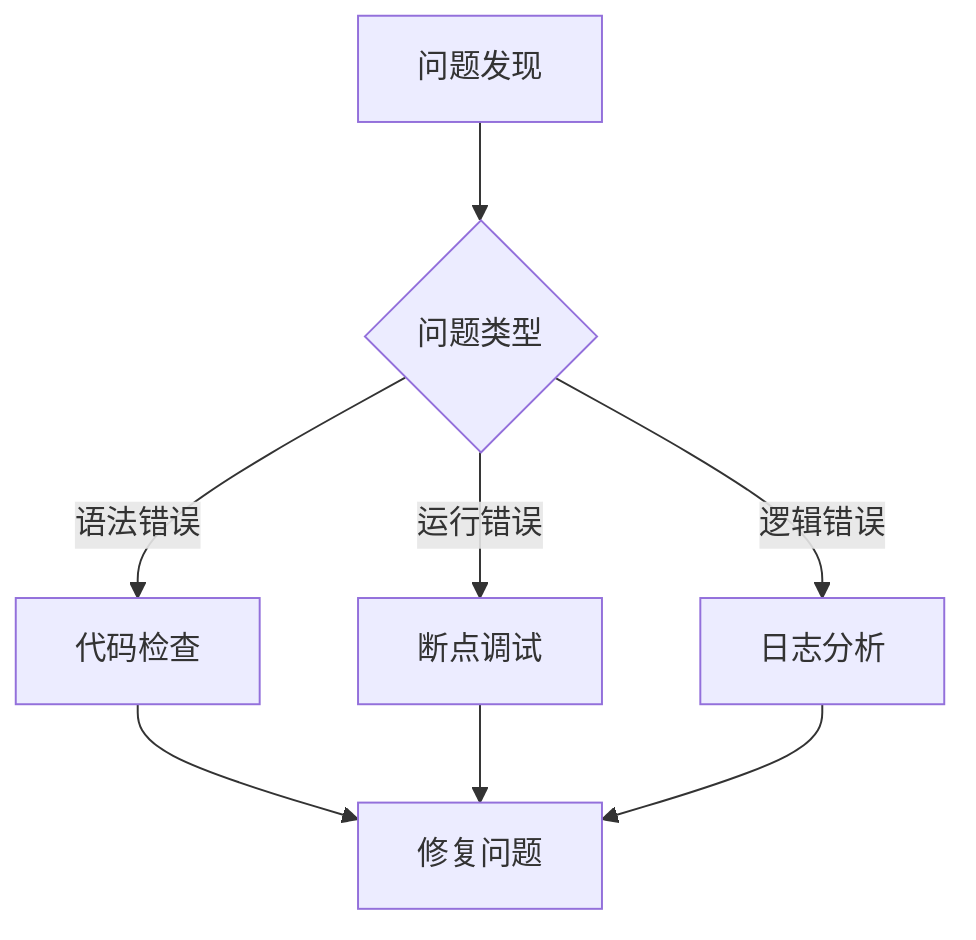

# 第四章 基本操作与实践

## 4.1 代码生成实践

### 4.1.1 基础代码生成



1. 功能实现示例
```python
# 示例：生成用户认证系统
需求描述：
- 实现用户注册和登录
- 支持邮箱验证
- 密码加密存储
- JWT 认证

生成提示：
"创建一个完整的用户认证系统，包含：
1. 用户模型设计
2. 注册和登录接口
3. 邮箱验证功能
4. JWT 认证中间件"
```

2. 代码优化示例
```python
# 原始代码
def process_data(data):
    result = []
    for item in data:
        if item > 0:
            result.append(item * 2)
    return result

# 优化提示：
"优化这个函数，使用列表推导式，
并添加类型提示和文档字符串"
```

### 4.1.2 批量代码生成

1. 模板定义
```plaintext
项目结构模板：
- src/
  - controllers/
  - models/
  - services/
  - utils/
- tests/
- config/
```

2. 配置参数
```yaml
project:
  name: "user-service"
  type: "web-api"
  language: "python"
  framework: "fastapi"
  
features:
  - auth
  - user-management
  - email-service
  
database:
  type: "postgresql"
  migrations: true
```

## 4.2 代码补全技巧

### 4.2.1 智能补全



1. 基础补全
```python
# 变量补全
user = User.
# 自动补全：id, name, email, etc.

# 函数补全
def process_user_data(user: User):
    user.
    # 自动补全：save(), update(), delete(), etc.
```

2. 智能补全
```python
# 上下文感知补全
with open('file.txt', 'r') as f:
    content = f.
    # 自动补全：read(), readline(), readlines(), etc.

# 类型感知补全
from datetime import datetime
date = datetime.
# 自动补全：now(), today(), strptime(), etc.
```

### 4.2.2 自定义补全

1. 代码片段
```json
{
  "api-endpoint": {
    "prefix": "api",
    "body": [
      "@router.${1|get,post,put,delete|}('/${2:path}')",
      "async def ${3:function_name}(",
      "    ${4:parameters}",
      ") -> ${5:ResponseType}:",
      "    ${0:pass}"
    ]
  }
}
```

2. 补全规则
```plaintext
- 文件类型匹配
- 关键词触发
- 上下文识别
- 自动格式化
```

## 4.3 代码重构实践

### 4.3.1 基础重构



1. 重命名重构
```python
# 重命名变量
old_name = "value"  # 选中 old_name
# 使用重构命令重命名为 new_name

# 重命名函数
def old_function():  # 选中 old_function
    pass
# 使用重构命令重命名为 new_function
```

2. 提取方法
```python
# 原始代码
def process_data():
    # 复杂的数据处理逻辑
    data = get_data()
    result = []
    for item in data:
        # 处理逻辑
        processed = complex_operation(item)
        result.append(processed)
    return result

# 重构提示：
"将数据处理逻辑提取为独立的函数，
提高代码可读性和复用性"
```

### 4.3.2 高级重构

1. 设计模式重构
```python
# 重构为工厂模式
class UserFactory:
    @staticmethod
    def create_user(user_type: str) -> User:
        if user_type == "admin":
            return AdminUser()
        elif user_type == "customer":
            return CustomerUser()
        raise ValueError(f"Unknown user type: {user_type}")
```

2. 性能优化重构
```python
# 原始代码
def find_items(items: List[Dict], condition: Dict) -> List[Dict]:
    result = []
    for item in items:
        match = True
        for key, value in condition.items():
            if item.get(key) != value:
                match = False
                break
        if match:
            result.append(item)
    return result

# 重构提示：
"优化查找性能，考虑使用索引或哈希表"
```

## 4.4 调试技巧

### 4.4.1 基础调试



1. 断点调试
```python
def process_user_data(user_data: Dict):
    # 设置断点
    user = User(**user_data)
    # 检查 user 对象
    result = user.save()
    # 验证保存结果
    return result
```

2. 日志调试
```python
import logging

logging.basicConfig(level=logging.DEBUG)
logger = logging.getLogger(__name__)

def complex_operation():
    logger.debug("Starting operation")
    try:
        result = perform_calculation()
        logger.info("Operation successful")
        return result
    except Exception as e:
        logger.error(f"Operation failed: {e}")
        raise
```

### 4.4.2 高级调试

1. 性能分析
```python
import cProfile
import pstats

def profile_code():
    profiler = cProfile.Profile()
    profiler.enable()
    # 运行代码
    main_function()
    profiler.disable()
    stats = pstats.Stats(profiler).sort_stats('cumulative')
    stats.print_stats()
```

2. 内存分析
```python
from memory_profiler import profile

@profile
def memory_intensive_function():
    # 内存密集操作
    large_list = [i * i for i in range(1000000)]
    return sum(large_list)
```

## 4.5 测试实践

### 4.5.1 单元测试

1. 测试用例编写
```python
import unittest

class TestUserService(unittest.TestCase):
    def setUp(self):
        self.service = UserService()
    
    def test_create_user(self):
        user_data = {
            "name": "Test User",
            "email": "test@example.com"
        }
        user = self.service.create_user(user_data)
        self.assertIsNotNone(user.id)
        self.assertEqual(user.name, user_data["name"])
```

2. 测试覆盖率
```python
# 运行测试并生成覆盖率报告
coverage run -m pytest
coverage report
coverage html  # 生成HTML报告
```

### 4.5.2 集成测试

```python
import pytest
from fastapi.testclient import TestClient

def test_user_api():
    client = TestClient(app)
    response = client.post(
        "/users/",
        json={
            "name": "Test User",
            "email": "test@example.com"
        }
    )
    assert response.status_code == 200
    assert response.json()["name"] == "Test User"
```

## 4.6 文档生成

### 4.6.1 代码文档

1. 文档字符串
```python
def process_data(data: List[Dict]) -> List[Dict]:
    """
    处理数据列表并返回处理后的结果。
    
    Args:
        data: 待处理的数据列表
        
    Returns:
        处理后的数据列表
        
    Raises:
        ValueError: 当输入数据格式不正确时
    """
    pass
```

2. API 文档
```python
from fastapi import FastAPI
from pydantic import BaseModel

class User(BaseModel):
    """
    用户模型
    
    Attributes:
        name: 用户名
        email: 邮箱地址
    """
    name: str
    email: str

@app.post("/users/")
async def create_user(user: User):
    """
    创建新用户
    
    Args:
        user: 用户信息
        
    Returns:
        创建的用户对象
    """
    pass
```

### 4.6.2 项目文档

1. README 模板
```markdown
# 项目名称

## 简介
项目描述和主要功能

## 安装
安装步骤和依赖要求

## 使用
基本使用方法和示例

## API文档
API接口说明

## 贡献
贡献指南

## 许可证
开源许可说明
```

2. 技术文档
```markdown
# 技术架构

## 系统架构
- 整体架构图
- 模块说明
- 技术栈

## 数据模型
- 数据库设计
- 模型关系

## 接口文档
- API接口列表
- 请求/响应示例
```

## 4.7 小结

本章详细介绍了 AI 辅助开发的基本操作和实践技巧：

1. 代码生成
   - 基础代码生成
   - 批量代码生成

2. 代码补全
   - 智能补全技巧
   - 自定义补全配置

3. 代码重构
   - 基础重构方法
   - 高级重构技巧

4. 调试和测试
   - 调试技巧
   - 测试实践

5. 文档生成
   - 代码文档
   - 项目文档

通过本章的学习，您应该能够：
- 熟练使用代码生成功能
- 善用代码补全提高效率
- 进行代码重构和优化
- 掌握调试和测试方法
- 生成完善的文档

在下一章中，我们将探讨分阶段开发指南，学习如何在不同开发阶段高效使用 AI 辅助工具。
