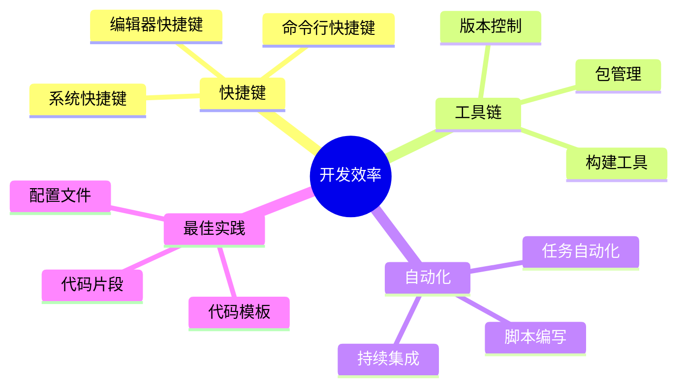

# 附录

## A.1 常用命令与技巧

### A.1.1 AI 编辑器常用命令

| 命令类型 | 命令格式 | 说明 | 示例 |
|---------|---------|------|------|
| 代码生成 | `/generate` | 生成新的代码 | `/generate 一个用户登录接口` |
| 代码解释 | `/explain` | 解释选中的代码 | `/explain 选中的代码块` |
| 代码优化 | `/optimize` | 优化当前代码 | `/optimize 性能优化` |
| 问题诊断 | `/debug` | 诊断代码问题 | `/debug 报错信息` |
| 测试生成 | `/test` | 生成测试用例 | `/test 为这个函数生成测试` |

### A.1.2 常用开发工具命令

```bash
# Git 常用命令
git init                 # 初始化仓库
git clone <url>          # 克隆仓库
git add .                # 添加所有改动
git commit -m "msg"      # 提交改动
git push origin main     # 推送到远程
git pull origin main     # 拉取更新

# Docker 常用命令
docker build -t name .   # 构建镜像
docker run -d name       # 运行容器
docker ps                # 查看容器
docker logs <container>  # 查看日志

# Node.js 常用命令
npm init                 # 初始化项目
npm install             # 安装依赖
npm run dev             # 运行开发服务器
npm run build           # 构建项目
npm run test            # 运行测试

# Python 常用命令
python -m venv venv     # 创建虚拟环境
source venv/bin/activate # 激活虚拟环境
pip install -r requirements.txt # 安装依赖
python manage.py runserver # 运行开发服务器
pytest                  # 运行测试
```

### A.1.3 效率提升技巧



## A.2 推荐的学习资源

### A.2.1 官方文档

1. **AI 工具文档**
   - [GitHub Copilot 文档](https://docs.github.com/en/copilot)
   - [OpenAI API 文档](https://platform.openai.com/docs)
   - [Cursor 文档](https://cursor.sh/docs)

2. **编程语言文档**
   - [Python 官方文档](https://docs.python.org/)
   - [JavaScript MDN](https://developer.mozilla.org/zh-CN/docs/Web/JavaScript)
   - [TypeScript 手册](https://www.typescriptlang.org/docs/)

3. **框架文档**
   - [React 文档](https://reactjs.org/docs/getting-started.html)
   - [Vue.js 文档](https://vuejs.org/guide/introduction.html)
   - [FastAPI 文档](https://fastapi.tiangolo.com/)

### A.2.2 在线学习平台

1. **综合平台**
   - Coursera
   - Udemy
   - edX

2. **编程专业平台**
   - LeetCode
   - GitHub
   - Stack Overflow

3. **AI 学习资源**
   - Hugging Face
   - Fast.ai
   - DeepLearning.AI

### A.2.3 推荐书籍

1. **AI 开发相关**
   - 《AI 辅助软件开发实践指南》
   - 《深度学习与软件工程》
   - 《智能编程助手实战》

2. **编程基础**
   - 《Clean Code》
   - 《重构：改善既有代码的设计》
   - 《设计模式》

3. **高级主题**
   - 《系统架构设计》
   - 《微服务架构实践》
   - 《云原生应用开发》

## A.3 术语表

### A.3.1 AI 相关术语

| 术语 | 英文 | 解释 |
|-----|------|------|
| 提示工程 | Prompt Engineering | 设计和优化 AI 模型输入提示的技术 |
| 代码补全 | Code Completion | AI 自动完成代码的功能 |
| 语义理解 | Semantic Understanding | AI 理解代码和自然语言含义的能力 |
| 智能重构 | Intelligent Refactoring | AI 辅助的代码重构过程 |
| 自动测试 | Automated Testing | AI 自动生成和执行测试用例 |

### A.3.2 开发相关术语

| 术语 | 英文 | 解释 |
|-----|------|------|
| 持续集成 | Continuous Integration | 频繁地将代码集成到主干的开发实践 |
| 持续部署 | Continuous Deployment | 自动将代码部署到生产环境 |
| 代码审查 | Code Review | 检查代码质量和正确性的过程 |
| 技术债务 | Technical Debt | 为快速开发而推迟的技术优化 |
| 敏捷开发 | Agile Development | 迭代式的软件开发方法论 |

### A.3.3 工具链术语

| 术语 | 英文 | 解释 |
|-----|------|------|
| 版本控制 | Version Control | 管理源代码版本的系统 |
| 依赖管理 | Dependency Management | 管理项目依赖包的工具 |
| 容器化 | Containerization | 将应用打包到容器中的技术 |
| 微服务 | Microservices | 将应用拆分为小型服务的架构 |
| 云原生 | Cloud Native | 为云环境设计的应用开发方法 |

## 索引

### 按主题索引

#### A
- AI 辅助开发 - 第1章, 第2章
- API 设计 - 第4章, 第8章
- 安全性 - 第4章, 第9章

#### C
- 持续集成 - 第7章
- 持续部署 - 第7章, 第8章
- 测试自动化 - 第4章, 第8章

#### D
- 代码生成 - 第3章, 第4章
- 代码优化 - 第6章
- 代码重构 - 第6章

#### J
- 集成测试 - 第8章
- 架构设计 - 第8章

#### K
- 开发效率 - 第4章
- 可维护性 - 第6章, 第9章

#### P
- Prompt 设计 - 第3章
- 配置管理 - 第7章

#### Q
- 前端开发 - 第8章
- 权限管理 - 第8章

#### S
- 数据库设计 - 第8章
- 事务处理 - 第8章

#### T
- 团队协作 - 第7章
- 调试技巧 - 第4章, 第9章

#### X
- 性能优化 - 第6章, 第8章
- 项目管理 - 第5章, 第7章

#### Y
- 用户认证 - 第8章
- 运维部署 - 第8章

#### Z
- 自动化测试 - 第4章, 第8章
- 质量保证 - 第6章, 第7章
